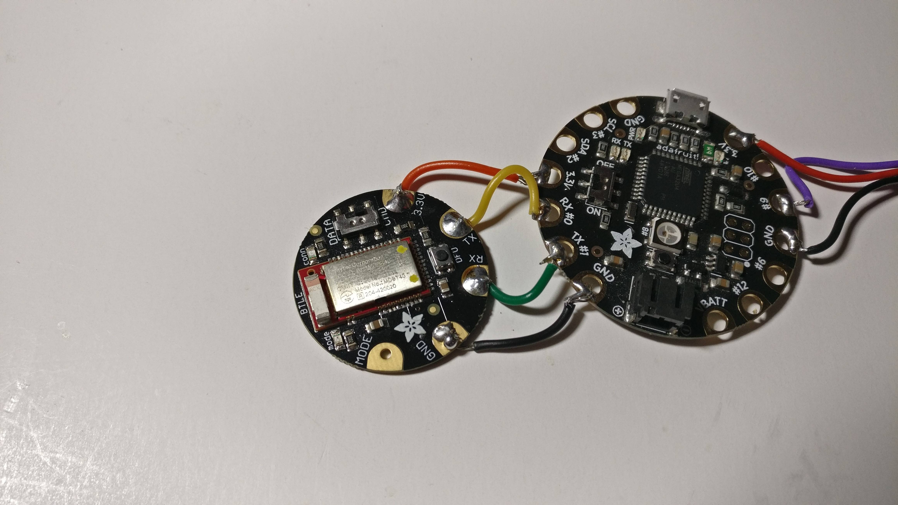
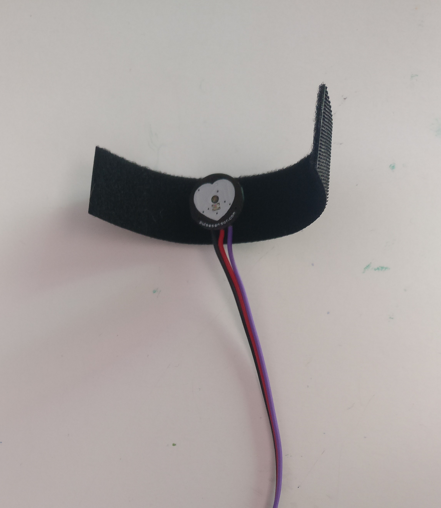
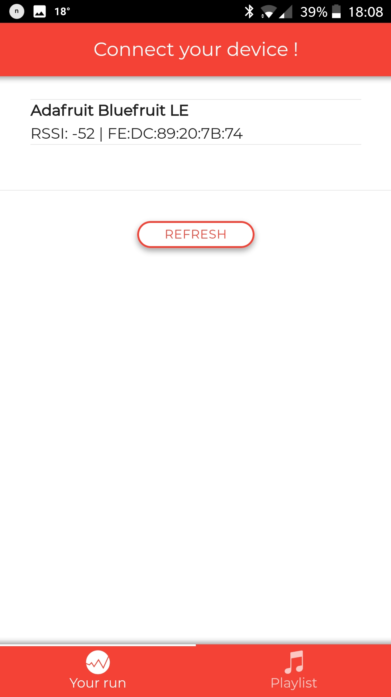
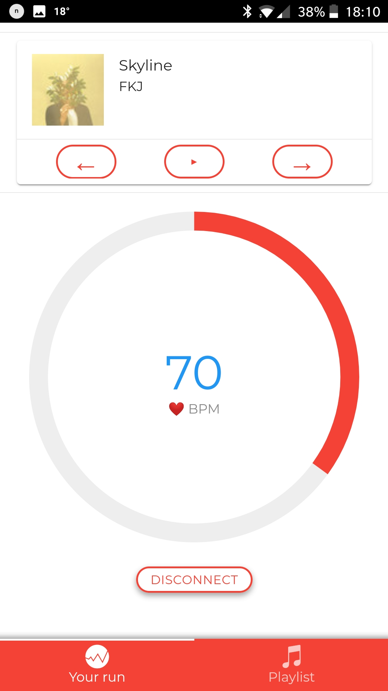
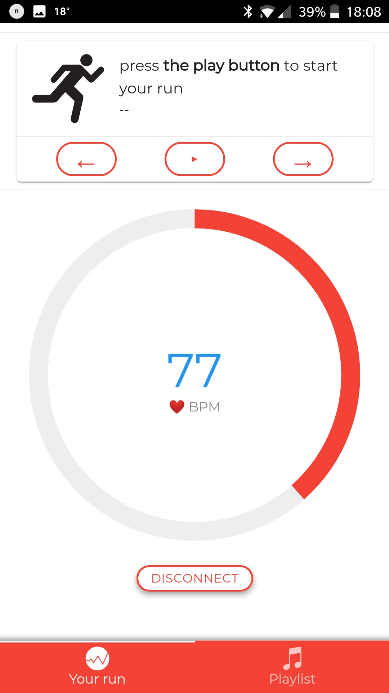
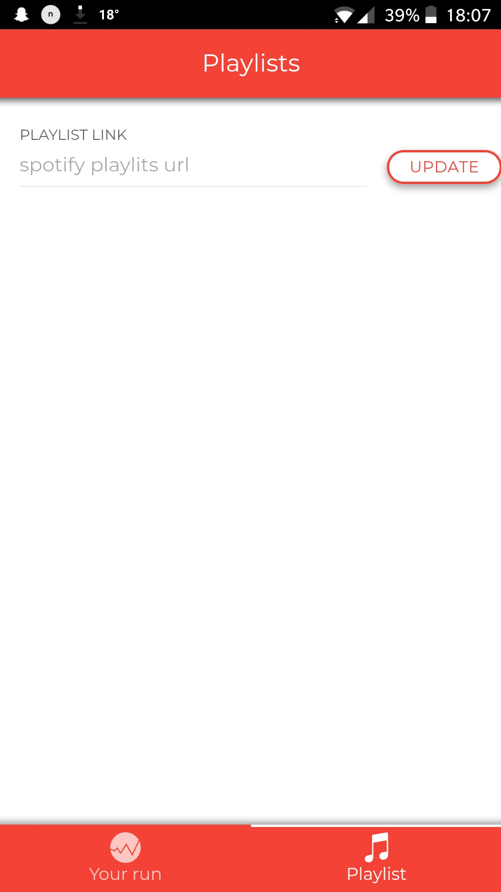

# Sportify App

A Cordova application that adjust your music to your heartbeat. 

The application works with an Arduino assembly with a Flora V3, a Bluefruit LE (for the bluetooth communication) and a Pulse Sensor from [pulsesensor.com](pulsesensor.com).

The video explaining the project (in french) : [Sportify](https://youtu.be/Iybsk5PmKsU)
## Want to try it ?
First you need to setup a Cordova application. Find more informations here : [Apache Cordova](https://cordova.apache.org/)

You also need to install some plugins : 
* [Cordova plugin whitelist](https://cordova.apache.org/docs/en/latest/reference/cordova-plugin-whitelist/)
* [Cordova plugin browsersync](https://www.npmjs.com/package/cordova-plugin-browsersync) (to debug easly)
* [Cordova Spotify OAuth](https://github.com/Festify/cordova-spotify-oauth)
* [Cordova Spotify](https://github.com/Festify/cordova-spotify)
* [Cordova Ble Central](https://github.com/don/cordova-plugin-ble-central) (bluetooth compatibility)

You also nned to setup your own Serverless service for AWS Lambda for the Spotify OAuth plugin as mentionned [here](https://github.com/Festify/cordova-spotify-oauth) 
Then, you need to connect your own Bluetooth device and connect it to the app !

<b>OTHER USAGE :</b> Now, you can simply download the <i>/cordova_app</i> folder and then run the command <code>cordova platform add android</code> and then <code>cordova run android --device</code> to start the app on your Android device !

# Images of the project

## The Flora V3 and the Bluefruit LE

 

## The Pulse Sensor

 
 

**Note:** A new version of the application is available here : https://github.com/Minifixio/sportify_ionic

## Application preview
   
